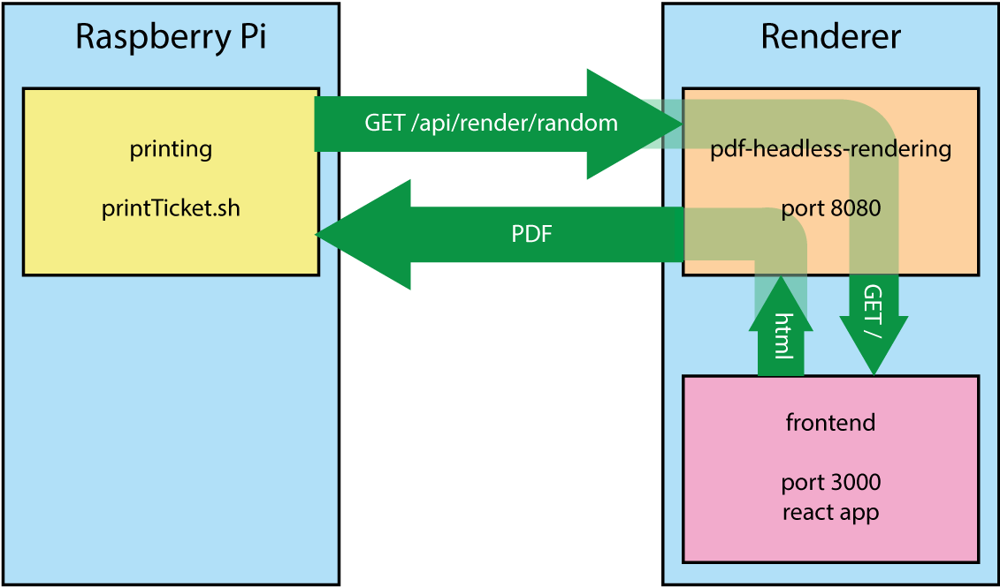

# Ticketing du fun

## Fonctionnement

Le système développé permet d'imprimer un ticket sur l'imprimante à l'appui d'un bouton. Le bouton et l'imprimante sont reliés à un Raspberry Pi.

À l'appui d'un bouton, le Raspberry Pi va demander au Renderer de générer un PDF à imprimer. 

